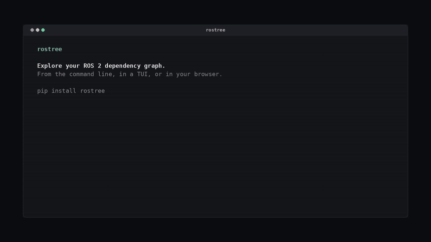
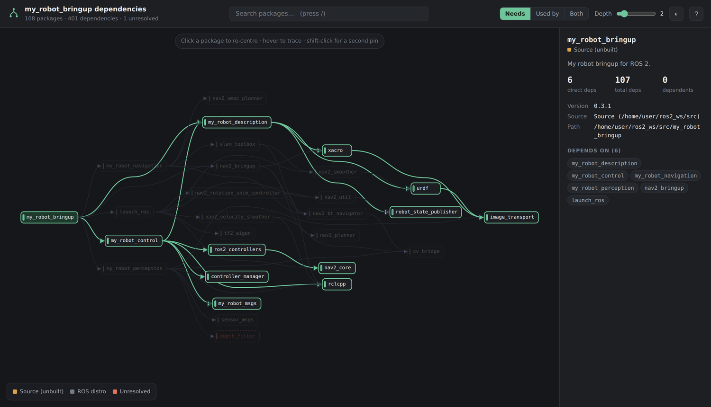
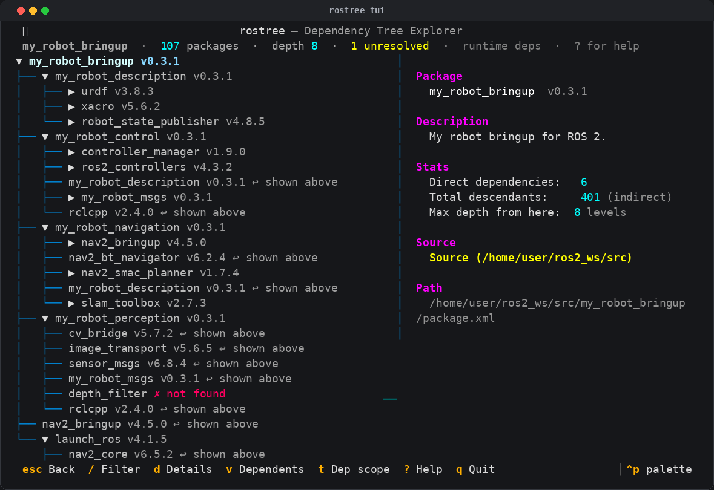
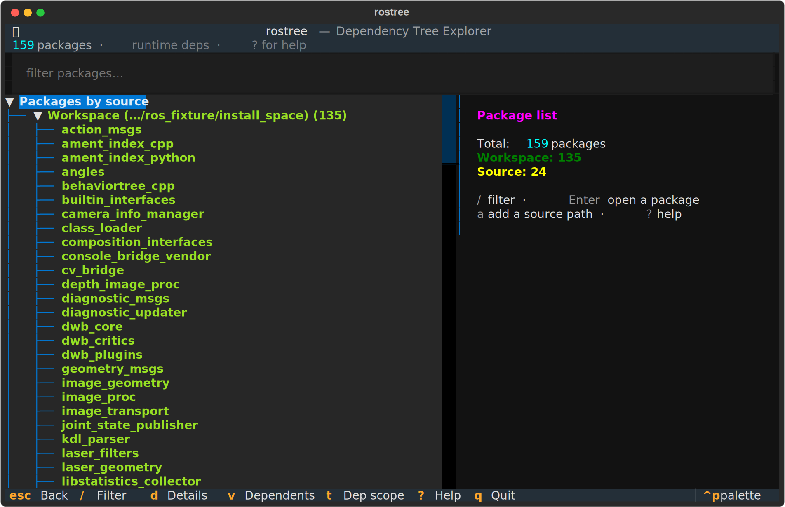
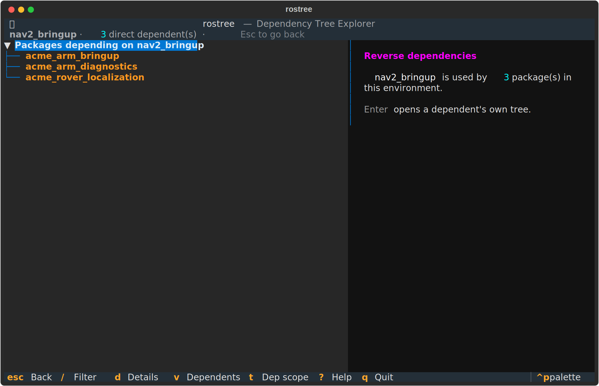

```
██████╗  ██████╗ ███████╗████████╗██████╗ ███████╗███████╗
██╔══██╗██╔═══██╗██╔════╝╚══██╔══╝██╔══██╗██╔════╝██╔════╝
██████╔╝██║   ██║███████╗   ██║   ██████╔╝█████╗  █████╗
██╔══██╗██║   ██║╚════██║   ██║   ██╔══██╗██╔══╝  ██╔══╝
██║  ██║╚██████╔╝███████║   ██║   ██║  ██║███████╗███████╗
╚═╝  ╚═╝ ╚═════╝ ╚══════╝   ╚═╝   ╚═╝  ╚═╝╚══════╝╚══════╝
```

[](https://github.com/guilyx/rostree/actions/workflows/ci.yml)
[](https://codecov.io/gh/guilyx/rostree)
[](https://pypi.org/project/rostree/)
[](https://pypi.org/project/rostree/)
[](https://pypi.org/project/rostree/)
[](https://github.com/guilyx/rostree/blob/main/LICENSE)

Explore your ROS 2 dependency graph — from the command line, in a TUI, or in your browser.



*[Full demo reel](docs/media/rostree-demo.mp4) · [how the demo was made](docs/media/README.md)*

**Docs:** [docs/README.md](docs/README.md) — overview, package discovery, dependency trees, usage, development.

## Quick start

```bash
pip install rostree
source /opt/ros/<distro>/setup.bash   # and/or your workspace install/setup.bash
rostree                               # interactive TUI
```

## The graph, in your browser

```bash
rostree graph my_robot_bringup -f html --open
```

One **self-contained file** — no CDN, no fonts, no network at all — so it survives
being mailed, committed next to a design doc, or opened on a robot with no route
out.

It never draws the whole graph at once, because a workspace drawn all at once is a
hairball nobody opens twice. You are always looking at one package's neighbourhood:

| | |
|---|---|
| **Click** | re-centre on that package |
| **Hover** | light up everything upstream and downstream of it, dim the rest |
| **Shift-click** | pin a second package and list the shortest paths between the two |
| `/` | search; `d` `u` `b` for dependencies · dependents · both; `[` `]` for depth |

<p align="center">
  
</p>

## Why it is fast

A ROS dependency graph is a **DAG, not a tree**: `rcutils` sits under almost every
branch. Expanding each path separately is exponential.

rostree expands each package **once, where it first appears**, and references it
elsewhere (`↩ see above`), the way `cargo tree` does with `(*)`. Package discovery
happens once per run instead of once per node, and manifests are parsed once.

Measured on a 146-package workspace (122 installed + a 24-package source overlay),
`rostree tree my_robot_bringup -r`:

| depth | 0.2.2 | now |
|-------|-------|-----|
| 5 | 1,876 lines / 0.43 s | 276 lines / 0.20 s |
| 6 | 6,258 lines / 1.18 s | 253 lines / 0.18 s |
| 7 | 16,623 lines / 3.04 s | 252 lines / 0.19 s |
| **no depth limit (the default)** | **58,002 lines / 10.29 s** | **251 lines / 0.21 s** |

Nothing is hidden: every edge is still shown, once. `--full` restores the fully
expanded tree if you want it. ([What is real in these numbers.](docs/media/README.md))

### CLI commands

```bash
rostree                      # Launch interactive TUI
rostree scan                 # Scan host for ROS 2 workspaces
rostree list --by-source     # List packages grouped by source
rostree list -f nav2         # Filter the package list

rostree tree rclcpp          # Dependency tree
rostree tree rclcpp -r -d 3  # Runtime deps only, 3 levels
rostree tree rclcpp --json   # Machine-readable

rostree why nav2_bringup rcutils   # How did this get into my tree?
rostree rdeps rclcpp               # What depends on this package?
rostree check                      # Cycles + unresolved deps (non-zero exit for CI)
rostree check --junit report.xml   # ...as a JUnit report for CI dashboards

rostree diff nav2_bringup nav2_route        # What differs between two packages?
rostree diff my_pkg --save deps.json        # Snapshot now...
rostree diff my_pkg --against deps.json     # ...and catch drift after a rebuild

rostree graph rclcpp -f html --open     # Interactive, one self-contained file
rostree graph rclcpp --render png       # PNG via Graphviz
rostree graph -w ~/ros2_ws -f html      # Whole workspace, explorable
rostree graph rclcpp -f mermaid         # Mermaid text
```

### Scope: most of what you can see is not yours

On a sourced machine most packages belong to the distro. Every command that walks
the graph takes the same filters:

```bash
rostree tree my_robot_bringup -w                 # ignore anything under /opt/ros
rostree tree my_robot_bringup --include 'nav2_*'
rostree tree my_robot_bringup --exclude '*_msgs' --exclude 'rosidl_*'
rostree tree my_robot_bringup --dep-type build   # runtime · build · test · all
```

A filtered package is neither shown nor followed, so anything reachable only
through it goes too. Commands report what they held back rather than passing a
smaller tree off as the whole truth.

### TUI

```bash
rostree tui                  # Interactive terminal UI
rostree tui rclcpp           # Start on a package's tree
```

`/` filters every package as you type, `Enter` opens a tree, `v` flips to
"what depends on this", `t` switches between runtime and all dependencies, and
`?` shows the full keymap. Scanning and tree building run off the UI thread, and
rows are created as you expand them, so nothing blocks.

<p align="center">
  
</p>

<p align="center">
  
  
</p>

### Python API

```python
from rostree import list_known_packages, get_package_info, build_tree, scan_workspaces
from rostree.api import build_graph, reverse_dependencies, tree_stats

packages = list_known_packages()
root = build_tree("rclcpp", runtime_only=True)
print(tree_stats(root))                  # nodes, packages, depth, repeats, missing

graph = build_graph("nav2_bringup")      # the resolved DAG, linear to build
print(graph.cycles(), sorted(graph.missing))

print(reverse_dependencies("rclcpp"))    # who depends on it
```

## Stability

From 1.0, the **CLI commands and their flags** and the names exported from
**`rostree.api`** follow semantic versioning: no incompatible changes without a
2.0. Anything under `rostree.core` is internal and may move.

The exact text and layout rostree prints is *not* covered — output is for people.
Pin `--json` if you are parsing it.

One thing worth knowing before you rely on it: the test suite runs entirely on
generated fixtures and has never been exercised against a real ROS 2 install. The
`<ws>/install/src` bug fixed in 0.3.0 had shipped in every release before it for
exactly that reason. Running against a `ros:jazzy` container is the top roadmap
item. 1.0 means the interface has settled, not that every layout in the wild is
covered — [please open an issue](https://github.com/guilyx/rostree/issues) if
yours is not.

## Links

- [How the system works](docs/overview.md)
- [How packages are found](docs/package-discovery.md) (workspaces, AMENT_PREFIX_PATH, COLCON_WORKSPACE)
- [Dependency trees](docs/dependency-trees.md) (package.xml, the package index, repeat collapsing)
- [Usage](docs/usage.md) (CLI, TUI keys, API)
- [Development](docs/development.md) (layout, pre-commit, CI)
- [Changelog](CHANGELOG.md)
